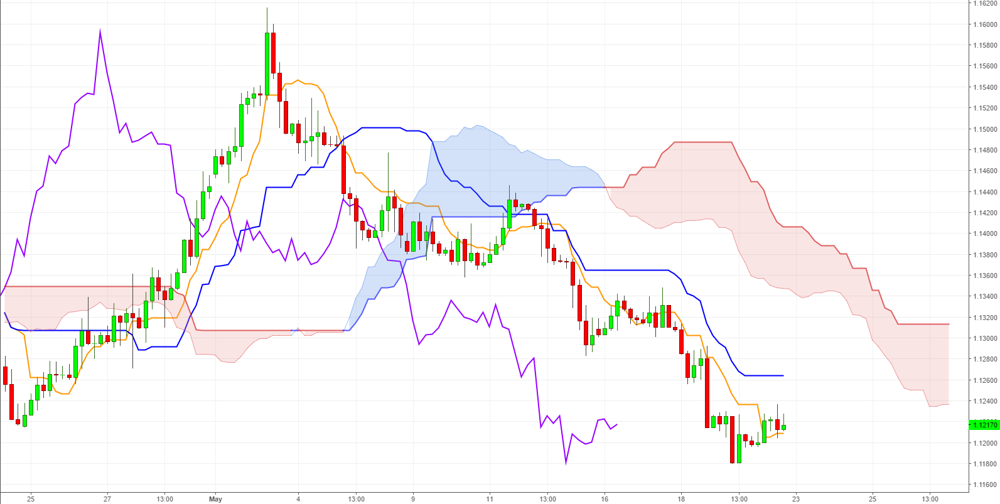

# netflix-insights
Énoncé : Choisissir un domaine (la santé, la finance, l’environnement, le juridique,
l’immobilier, etc) et expliquez ce qu’il est possible de faire dans ce domaine
grâce à l’intelligence artificielle.

Domaine : Trading 

Le trading consiste a acheter et a vendre des titres tels que des actions, des obligations, des devises et des matières premières. Il existe énormément de méthodes pour avoir les indicateur d'une augmentation ou d'une diminution de valeurs grace aux graphiques 
Comme l'une des plus connu : ichimoku 

Avec une IA on pourrait soit faire du machine learning qui analyserait énormément de graphique ayant eu une augmentation puis ceux qui ont connu une diminution afin que l'IA connaissent les indicateurs d'augmentation et de diminution tout seul. Ou alors on pourrait faire une IA qui reconnait les indicateur d'après une vraie methode. Je ne sais pas si ca serait possible de le laisser placer les investissement tout seul (ça représenterait de gros risque) mais ce qui est sur c'est qu'il pourrait nous avertir en envoyant une notification par exemple et de nous dire d'acheter ou de vendre a une heure précise .